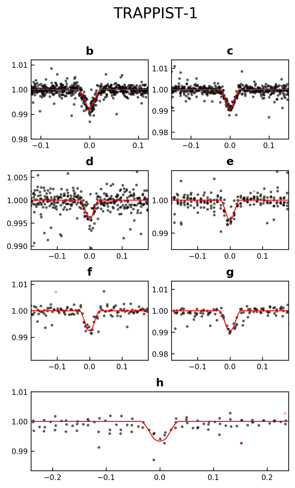
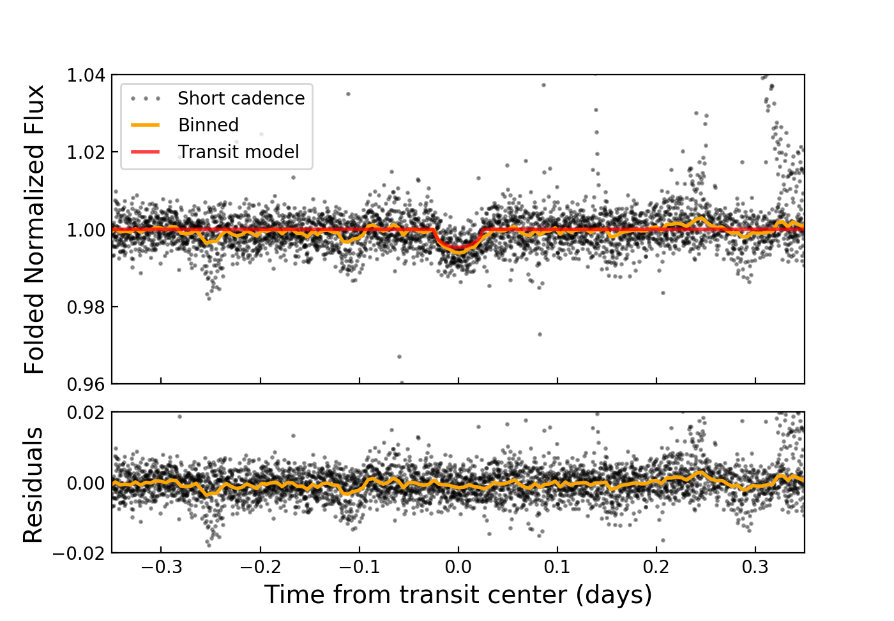
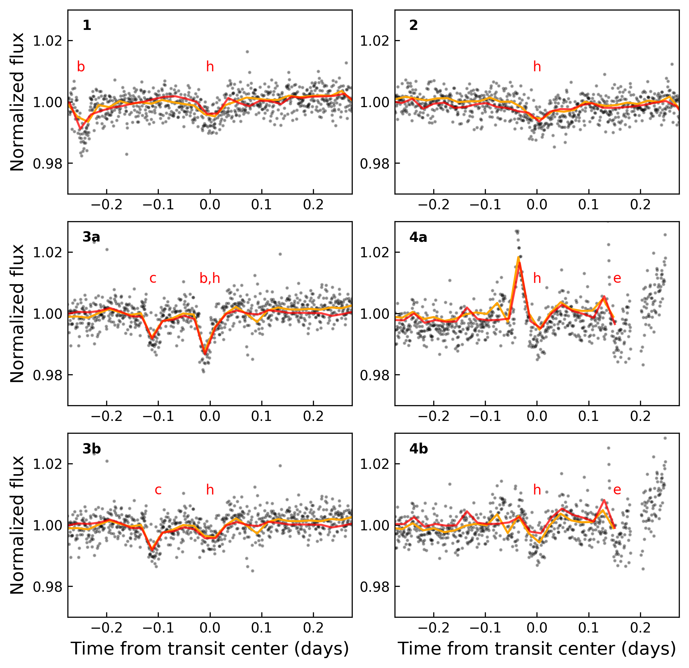
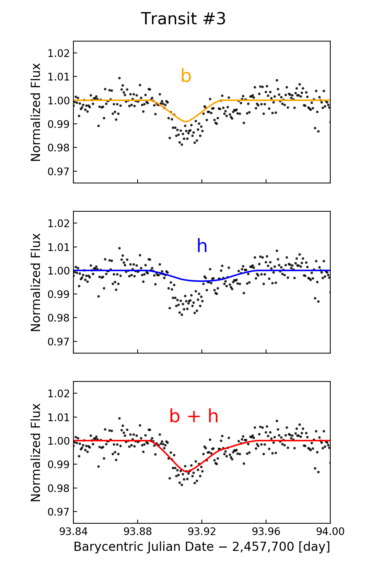
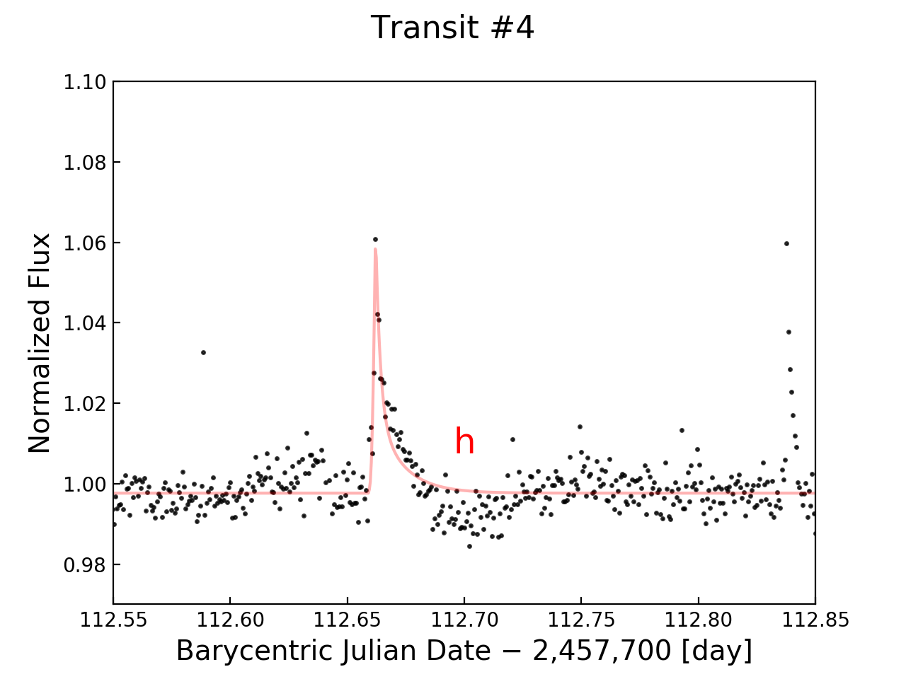
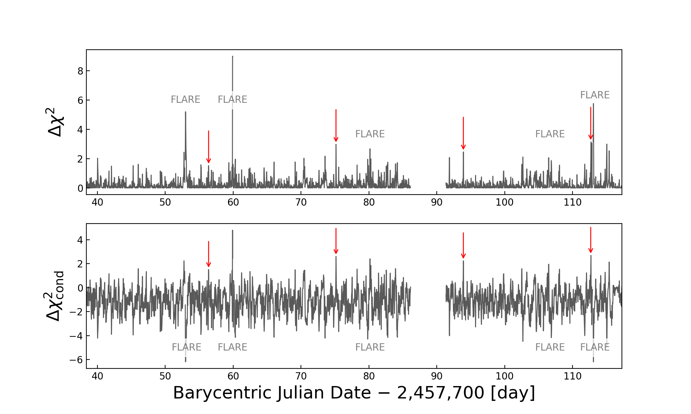
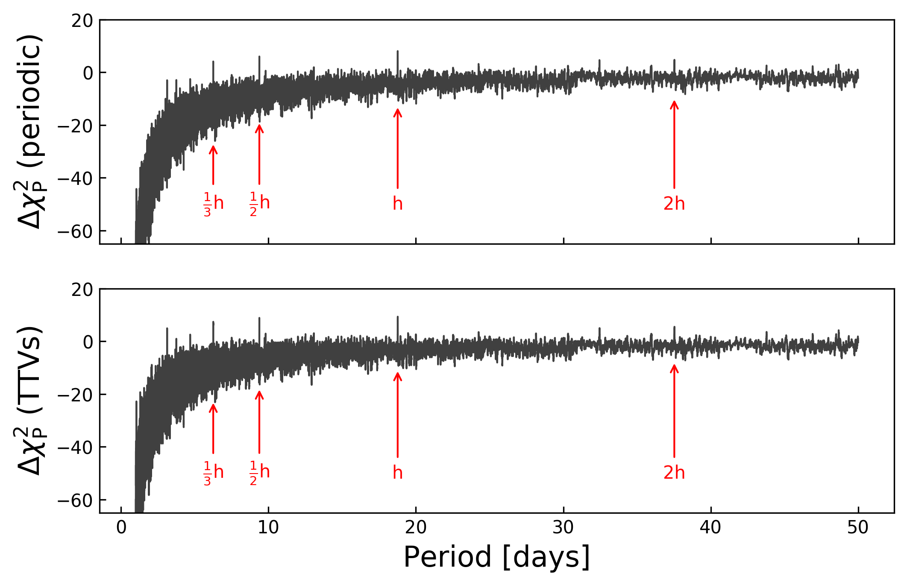

  

  
  
  

<b>[3/23/2017]:</b> *We noticed that the pseudo-TPFs we used in the original version of the code reported timestamps in geocentric time, NOT BJD. This led to an offset of about 10 minutes, which affected some of our short cadence timing analyses. This issue has since been corrected, and all light curves and plots have been updated to reflect the correct BJD. The Zenodo link to the raw dataset has also been updated.*

<b>[3/15/2017]:</b> *Several bugs were recently fixed. Please pull again and upgrade your everest installation.* *Big thanks to Hans Martin Schwengeler.*

## Introduction
The planet-hosting star [TRAPPIST-1](https://en.wikipedia.org/wiki/TRAPPIST-1) was recently [observed](https://archive.stsci.edu/k2/trappist1/) with the [*K2* spacecraft](https://keplerscience.arc.nasa.gov/). Recently, [seven transiting planets](http://www.nature.com/nature/journal/v542/n7642/full/nature21360.html) were found around this star, but the outermost of these, TRAPPIST-1 **h**, was only seen in transit once, so its period was not known. While the *K2* observations had the potential to find more transits of **h** (thereby constraining its orbit), there are two major issues difficulting this measurement. First, since TRAPPIST-1 is an [ultracool dwarf](https://en.wikipedia.org/wiki/Ultra-cool_dwarf), it is extremely dim in the band at which *K2* observes. Second, because of its inability to point precisly, *K2* introduces substantial [instrumental noise](https://keplerscience.arc.nasa.gov/k2-observing.html#campaigns) into its light curves, swamping out the small transit signals.

In a paper recently submitted to [Nature Astronomy](https://arxiv.org/abs/1703.04166), we use the [EVEREST](https://github.com/rodluger/everest) pipeline to de-trend the TRAPPIST-1 *K2* light curve and search for planet **h**. We report on the detection of four transits of planet **h**, constraining its period to be 18.764 days, in agreement with theoretical predictions based on [Laplace relations](https://en.wikipedia.org/wiki/Orbital_resonance#Laplace_resonance).

## What's In Here
This repository contains the <b>EVEREST</b> long cadence light curve ([FITS](output/nPLDTrappist.fits) | [PDF](output/nPLDTrappist.pdf)), segments of the short cadence light curve in the vicinity of each transit of planet <b>h</b> ([FITS1](output/nPLDTrappisth1.sc.fits) | [PDF1](output/nPLDTrappisth1.sc.pdf) | [FITS2](output/nPLDTrappisth2.sc.fits) | [PDF2](output/nPLDTrappisth2.sc.pdf) | [FITS3](output/nPLDTrappisth3.sc.fits) | [PDF3](output/nPLDTrappisth3.sc.pdf) | [FITS4](output/nPLDTrappisth4.sc.fits) | [PDF4](output/nPLDTrappisth4.sc.pdf)), and all of the code necessary to reproduce and analyze these light curves and plot the figures in our [Nature Astronomy paper](#). If you're interested in using this code to reproduce our results or adapt it to your needs, read on!

## Installation
In order to run the scripts and interact with the light curves in this repository, you will need to install the latest <b>EVEREST</b> release (>=2.0.8):
<pre><code>pip install everest-pipeline</code></pre>
If you alread have <b>EVEREST</b> installed, please upgrade it:
<pre><code>pip install everest-pipeline --upgrade</code></pre>
For more information on installing and using <b>EVEREST</b>, check out the [project github page](https://github.com/rodluger/everest).
Next, you have a choice: you can either **(1)** use the pre-existing FITS files in the [output](output) folder to reproduce our figures, conduct planet searches, etc., or **(2)** you can generate them all from scratch.

### 1. Use Existing FITS Files
This one is easy. If you simply run [trappist1.py](trappist1.py), it will automatically copy the FITS files over to the **EVEREST** directory for TRAPPIST-1 and run the scripts to generate all the figures. You can then peek at the code and tailor it to your needs. 

### 2. De-trend from Scratch
This one is a little more involved. First, you'll have to download the raw TPF data for TRAPPIST-1 and its neighbors from [this Zenodo link](https://doi.org/10.5281/zenodo.437876) and place them in the [data folder](data/). Next, comment out [these lines in trappist1.py](https://github.com/rodluger/trappist1/blob/166c9d880761fcba0fa7083dd6b31126bcc99020/trappist1.py#L452-L454) to force the code to generate new FITS files. As the TPFs are ingested into **EVEREST**, you will be asked to manually select apertures for each target. Do this by clicking and dragging along the pixels you want in the aperture. Please note that the targets move around a lot over the course of the campaign (slide the bar at the bottom to see the postage stamp at different points in time). You'll have to define an aperture that's large enough to contain virtually all of the flux from the target, but not *too* large as to compromise the background subtraction routine. For saturated stars, add a little padding at the top and bottom of saturated columns just in case.

## The Code
The methods in [trappist1.py](trappist1.py) allow users to plot and interact with the <b>EVEREST</b> light curve for TRAPPIST-1, as well as to reproduce several of the figures in the <a href="#">paper</a>.

### trappist1.PlotFolded()
Folded long cadence plots for each of the seven planets transiting TRAPPIST-1:

  

### trappist1.ShortCadence()
The long cadence data folded on the period of planet <b>h</b>:

  

Each of the individual four transits of planet <b>h</b>, with a simultaneous transit of <b>b</b> and a near-simultaneous flare removed in the bottom panels:

  

A closer look at what's going on during the third transit:

  

A closer look at what's going on during the fourth transit, with a flare fit based on [Davenport et al. (2014)](http://adsabs.harvard.edu/abs/2014ApJ...797..122D):

  

### trappist1.DeltaChisq()
The delta-chi squared long cadence plot (top) and the delta-chi squared conditioned on the true depth of planet <b>h</b> (bottom):

  

### trappist1.PowerSpectrum()
The delta-chi squared long cadence power spectrum, where the period of <b>h</b> and its aliases are clearly visible:

  

## Attribution
If you make use of the light curves, code, or images in this repository, please cite this repository and the following papers:

1. [Luger et al. (2017)](https://arxiv.org/abs/1703.04166) - A Terrestrial-sized Planet at the Snow Line of TRAPPIST-1
2. [Luger et al. (2017)](http://adsabs.harvard.edu/abs/2017arXiv170205488L) - An Update to the EVEREST Pipeline
3. [Luger et al. (2016)](http://adsabs.harvard.edu/abs/2016AJ....152..100L) - EVEREST: Pixel Level Decorrelation of K2 Light Curves
