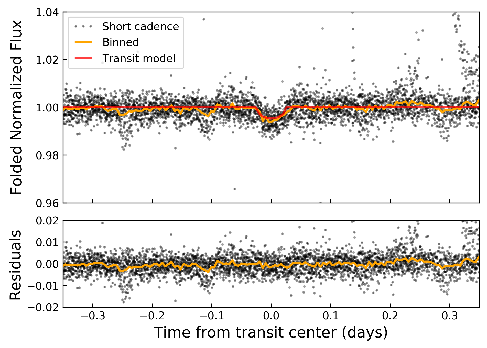
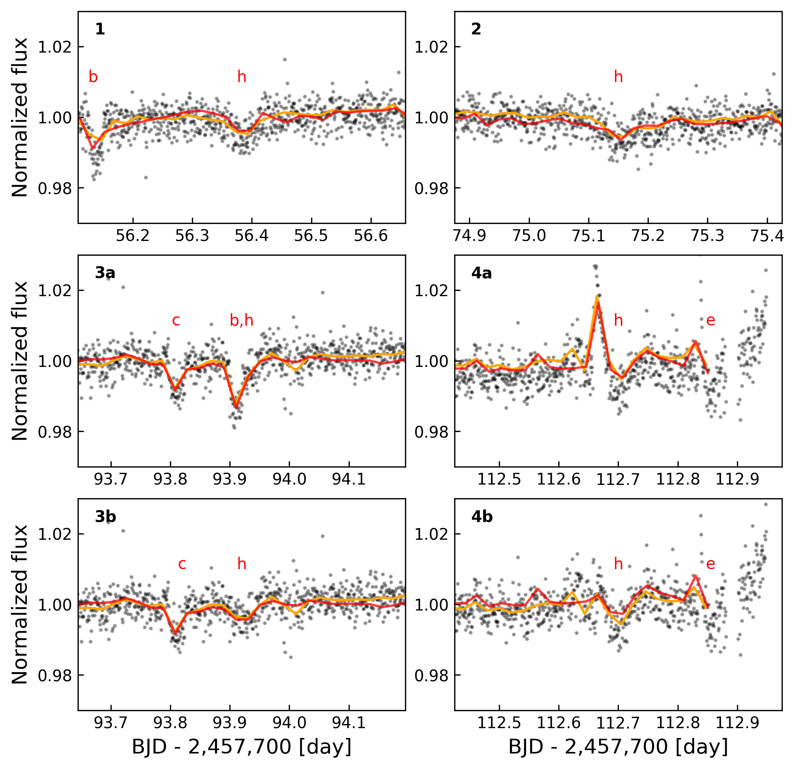
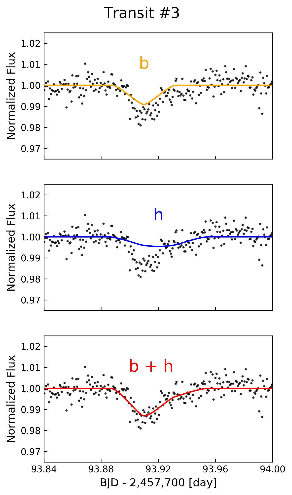
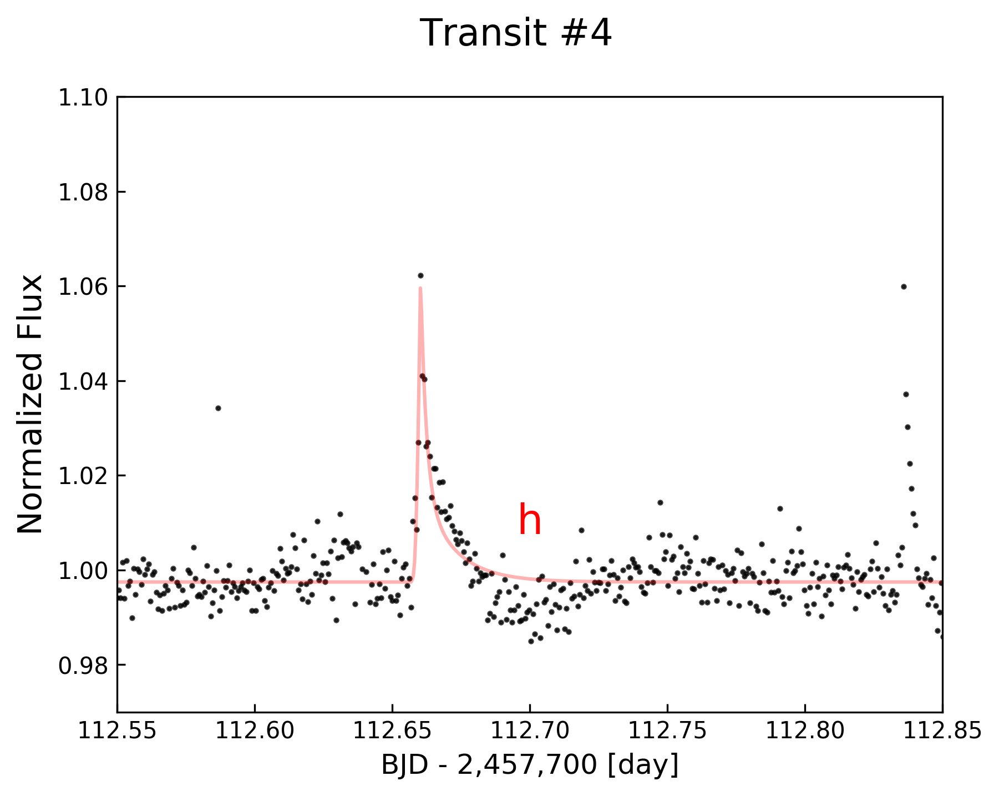
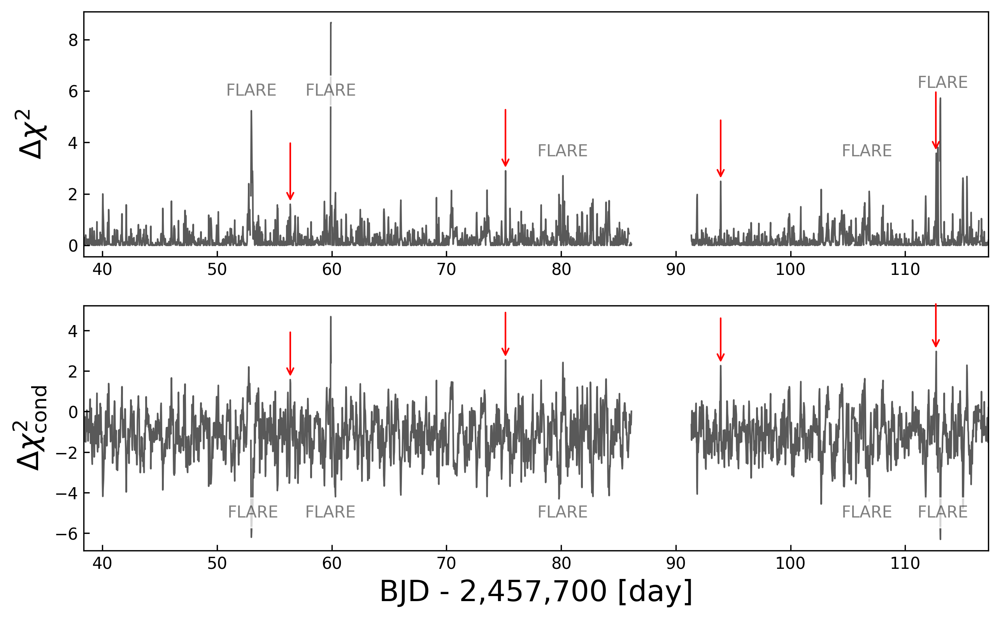

  

  
  
  

## Installation
In order to run the scripts and interact with the light curves in this repository, you will need to install the latest <b>EVEREST</b> release (>=2.0.7):
 
<pre><code>pip install everest-pipeline</code></pre>
If you alread have <b>EVEREST</b> installed, please upgrade it:
 
<pre><code>pip install everest-pipeline --upgrade</code></pre>
 
For more information on installing and using <b>EVEREST</b>, check out the [project github page](https://github.com/rodluger/everest). 

The methods in [trappist1.py](trappist1.py) allow users to plot and interact with the <b>EVEREST</b> light curve for TRAPPIST-1, as well as to reproduce several of the figures in the <a href="#">paper</a>.

## trappist1.PlotFolded()
Folded long cadence plots for each of the seven planets transiting TRAPPIST-1:

  

## trappist1.ShortCadence()
The long cadence data folded on the period of planet <b>h</b>:

  

Each of the individual four transits of planet <b>h</b>, with a simultaneous transit of <b>b</b> and a near-simultaneous flare removed in the bottom panels:

  

A closer look at what's going on during the third transit:

  

A closer look at what's going on during the fourth transit, with a flare fit based on [Davenport et al. (2014)](http://adsabs.harvard.edu/abs/2014ApJ...797..122D):

  

## trappist1.DeltaChisq()
The delta-chi squared long cadence plot (top) and the delta-chi squared conditioned on the true depth of planet <b>h</b> (bottom):

  

## trappist1.PowerSpectrum()
The delta-chi squared long cadence power spectrum, where the period of <b>h</b> and its aliases are clearly visible:

  

